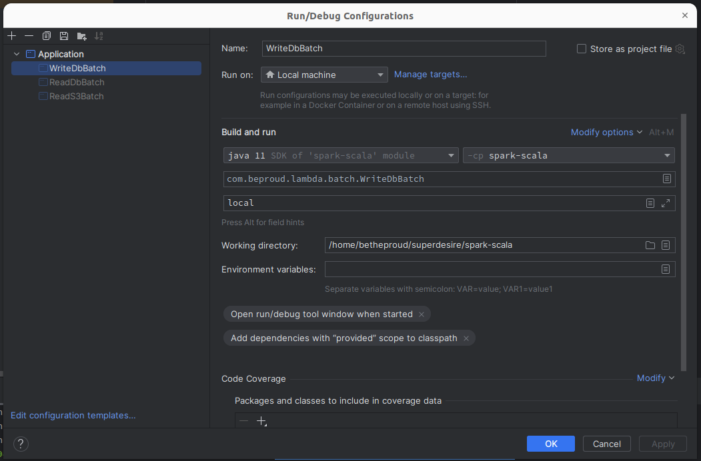

# Spark Scala

## Lambda Architecture

https://www.databricks.com/glossary/lambda-architecture

## Run

- Add dependencies with "provided" scope to classpath 설정 필요
- Program Argument 설정(local) 필요
- docker compose up으로 MySQL 실행

## Docker

create topic

docker-compose exec kafka kafka-topics --create --topic sample-topic --bootstrap-server kafka:9092 --replication-factor 1 --partitions 1
docker-compose exec kafka kafka-topics --describe --topic sample-topic --bootstrap-server kafka:9092

betheproud@betheproud-MS-7C94:~/superdesire/spark-scala$ docker-compose exec kafka bash
[appuser@e6233be12595 ~]$ kafka-console-consumer --topic sample-topic --bootstrap-server kafka:9092
